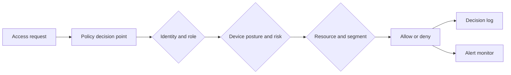

# Zero Trust Architecture Simulation

A tested academic security prototype that evaluates every access request against identity, account status, role, device ownership and posture, risk, resource sensitivity, and network-segment policy before allowing access.

The repository connects cloud/Linux administration and network evidence with executable Python policy logic. It is intentionally presented as a **controlled academic prototype**, not as a production identity platform, network access control system, or SIEM.

## Portfolio artifacts

| Artifact | Best use | What it demonstrates |
|---|---|---|
| [Narrated PowerPoint presentation](portfolio/Autenia_Murray_Zero_Trust_Narrated_Slideshow.ppsx) | Download and open in desktop PowerPoint | 12 slides with approximately 15 minutes of embedded narration and complete speaker-note transcripts |
| [Presentation PDF](portfolio/Autenia_Murray_Zero_Trust_Presentation.pdf) | Fast browser preview | Concise visual explanation of the security problem, architecture, evidence, results, limitations, and next steps |
| [Final technical report](portfolio/Autenia_Murray_Zero_Trust_Final_Report.pdf) | Detailed technical review | Full project rationale, Azure/Linux lab evidence, policy implementation, controlled network testing, results, and supporting documentation |

### Viewing the narrated presentation

GitHub does not play embedded PowerPoint narration in its browser preview. Download the `.ppsx` file and open it in the desktop version of Microsoft PowerPoint. The slideshow includes one narration track per slide. The narration is also written in each slide's speaker notes for accessibility and review.

## Verified results

| Measure | Result |
|---|---:|
| Defined access scenarios | 13 |
| Policy tests passed | 13 / 13 |
| Allowed requests | 3 |
| Denied requests | 10 |
| Alerts generated | 13 |

These numbers are generated by the code in [`src/zero_trust_simulation.py`](src/zero_trust_simulation.py) and independently checked by the automated tests.

## What the simulation demonstrates

- **Identity verification:** unknown and inactive accounts are denied.
- **Least privilege:** roles must be authorized for the requested resource.
- **Device trust:** ownership, management status, compliance, encryption, and risk are evaluated.
- **Micro-segmentation:** source segments must be approved for each protected resource.
- **Continuous monitoring:** denials are logged, and repeated failures create higher-severity alerts.
- **Evidence-based validation:** every scenario records its expected and actual decision in CSV output.

## Architecture



See [`docs/architecture.md`](docs/architecture.md) for the policy flow and component mapping.

## Repository layout

```text
.
├── src/zero_trust_simulation.py   # data model, policy engine, monitoring, scenarios, CSV export
├── tests/test_zero_trust_simulation.py
├── results/                       # generated, synthetic decision and alert evidence
├── docs/architecture.md
├── docs/evidence.md
├── portfolio/                     # narrated presentation, presentation PDF, and final report
└── .github/workflows/tests.yml
```

## Run the project

Requirements: Python 3.10 or later. The simulation uses only the Python standard library.

```bash
python src/zero_trust_simulation.py
```

The command rewrites three synthetic output files in `results/`:

- `access_log.csv` — complete access decisions and reasons
- `alerts.csv` — policy-denial and repeated-denial alerts
- `test_summary.csv` — expected-versus-actual outcomes

## Run the tests

```bash
python -m unittest discover -s tests -v
```

## Project context

This project was completed for **CSCI 7536 Network and Computer Security**. The broader lab work also included:

- securing an Azure-hosted Ubuntu VM;
- restricting SSH access to a trusted `/32` source;
- generating controlled traffic;
- inspecting packet evidence with `tcpdump` and Wireshark; and
- using `nmap` during controlled validation.

The public repository does not contain credentials, SSH keys, cloud account details, real public IP addresses, or the raw packet capture. The included CSV files use synthetic identifiers and are safe examples of the program's output.

## Scope and limitations

- The users, devices, resources, and access requests are synthetic and static.
- MFA, TLS, and device posture are represented as policy attributes rather than integrations with live providers.
- The monitoring engine detects policy denials and repeated failures; it is not a behavioral-analytics platform.
- Azure and Ubuntu configuration evidence is summarized rather than published with identifying infrastructure details.

## Next steps

- integrate a real identity provider and short-lived credentials;
- consume live endpoint-compliance signals;
- centralize protected logs and alert routing;
- add risk-based and time-aware access rules; and
- map the logical policies to network enforcement controls in a dedicated lab.
