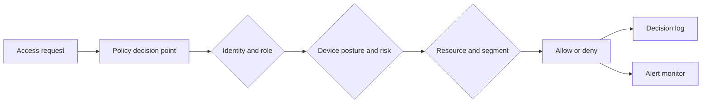

# Zero Trust Architecture Simulation

[](https://github.com/AT-365/zero-trust-architecture-simulation/actions/workflows/tests.yml)

A hybrid security project combining a controlled Azure Ubuntu lab with an executable Python Zero Trust policy engine. The project demonstrates secure remote administration, local traffic capture, user-access decisions, structured logging, and alert escalation.

**Project Scope:** This is an intentionally controlled academic prototype. The cloud lab provides real configuration and packet-capture evidence, while the Python simulation models access decisions. It is not a production identity platform, network access control system, or SIEM deployment.

> **Project type:** Individual graduate Network and Computer Security project
>
> **Course term:** Spring 2025

## Why This Project Matters

This project demonstrates critical security architecture and software design skills:

- designing policy decision engines with multiple independent security checks
- implementing identity and access management logic
- building device trust evaluation systems
- creating alert and monitoring systems with escalation logic
- prototyping security architecture before live deployment
- testing access control policies with structured scenarios
- documenting security decisions and trade-offs clearly
- connecting theory (zero trust principles) to code (policy engine)

## Project Overview

The project has two connected parts:

1. **Azure and Ubuntu lab:** A cloud virtual machine, restricted SSH administration, a protected local HTTP resource, controlled traffic generation, and packet capture with `tcpdump`.
2. **Python policy simulation:** A reproducible access-control engine that evaluates users, devices, source segments, and protected resources.

The simulation applies the following security criteria to each request:

1. **Identity verification** - Is the user known and active?
2. **Role-based access control** - Does the user's role permit access to this resource?
3. **Device trust** - Is the device owned by the organization, managed, compliant, and encrypted?
4. **Device risk assessment** - Is the device risk score below the denial threshold?
5. **Resource sensitivity** - How sensitive is the requested resource?
6. **Micro-segmentation** - Is the source network segment approved for this resource?
7. **Continuous monitoring** - Are access denials and repeated failures being tracked?

Together, the lab and simulation connect Zero Trust theory to cloud configuration, network evidence, executable policy logic, and auditable results.

## Verified Portfolio Metrics

| Measure | Result |
|---|---:|
| Access scenarios defined | 13 |
| Scenario outcomes matching expectations | 13 / 13 (100%) |
| Requests allowed | 3 |
| Requests denied | 10 |
| Policy-denial alerts | 10 |
| Repeated-denial escalation alerts | 3 |
| Total alerts generated | 13 |
| Automated `unittest` methods | 4 |

These numbers are generated by [`src/zero_trust_simulation.py`](src/zero_trust_simulation.py) and checked by [`tests/test_zero_trust_simulation.py`](tests/test_zero_trust_simulation.py). The 13 results are defined access scenarios; they should not be confused with the four automated test methods. A separate code-coverage percentage has not been claimed.

## What the Simulation Demonstrates

- **Identity verification:** Unknown users and inactive accounts are denied access.
- **Least privilege:** Users must have roles explicitly authorized for the requested resource.
- **Device trust evaluation:** Device ownership, management status, compliance status, encryption, and risk level are all considered independently.
- **Micro-segmentation enforcement:** Source network segments are approved per resource; access is denied if the segment is not authorized.
- **Continuous monitoring:** Every policy denial is logged. Repeated denials from the same device trigger escalated severity alerts.
- **Evidence-based decisions:** Every access scenario produces a CSV record showing the request, the controls evaluated, the decision made, and the reason for that decision.

## What I Built

- **Access request data model** representing user, device, resource, and request context
- **Policy decision point (PDP) engine** applying identity, authorization, device, resource, risk, and source-segment checks
- **Identity verification system** checking user existence and account status
- **Role-based access control (RBAC)** engine with resource-level permissions
- **Device trust evaluator** assessing ownership, compliance, encryption, and risk
- **Micro-segmentation enforcer** validating network segment to resource mappings
- **Continuous monitoring engine** tracking denials and generating escalated alerts
- **13 structured access scenarios** covering allowed and denied requests
- **Structured CSV export system** producing decision logs and alert records
- **Four-method automated test suite** validating scenario results, decision totals, alert totals, and an unknown-user edge case

## Technologies & Methods

- **Python 3.10+:** Object-oriented policy engine design with clean separation of concerns
- **Python standard library only:** No external dependencies; portable and lightweight
- **Object-oriented design:** Policy objects, decision point classes, logging and alert systems
- **unittest framework:** Automated validation of policy behavior and result consistency
- **CSV logging:** Reproducible, auditable decision and alert records
- **Mermaid diagrams:** Architecture visualization and decision flow documentation
- **GitHub Actions:** Automated test execution on every push and pull request
- **Azure + Ubuntu Linux:** Lab environment for collecting real security configuration evidence
- **tcpdump:** Packet capture and command-line inspection of controlled HTTP traffic
- **nmap:** Controlled security scanning and network validation

## Quick Start

Run the complete simulation:

```bash
python src/zero_trust_simulation.py
```

This generates three CSV files in `results/`:

- `access_log.csv` — every access decision with reasons
- `alerts.csv` — policy violations and escalated alerts  
- `test_summary.csv` — expected vs. actual outcomes

Run the automated tests:

```bash
python -m unittest discover -s tests -v
```

Inspect the decision output:

```bash
cat results/access_log.csv
cat results/alerts.csv
```

## Architecture

Zero Trust policy decisions flow through multiple independent checks:


```mermaid
flowchart LR
    A[Access request] --> B[Policy decision point]
    B --> C{Identity and role}
    C --> D{Device posture and risk}
    D --> E{Resource and segment}
    E --> F[Allow or deny]
    F --> G[Decision log]
    F --> H[Alert monitor]
```

**Decision flow:**
1. Verify user identity and account status
2. Check role authorization for the resource
3. Evaluate device trust (ownership, compliance, encryption, risk)
4. Validate network segment for this resource
5. Log the decision (allow or deny)
6. If denied, generate or escalate alert

See [`docs/architecture.md`](docs/architecture.md) for detailed policy flow and component mapping.

## Repository Map

| Path | Purpose |
|---|---|
| [`src/zero_trust_simulation.py`](src/zero_trust_simulation.py) | Policy engine, data models, scenario runner, CSV export |
| [`tests/test_zero_trust_simulation.py`](tests/test_zero_trust_simulation.py) | Automated test suite validating policy logic |
| [`results/`](results/) | Generated CSV outputs (access log, alerts, test summary) |
| [`evidence/`](evidence/) | Localhost HTTP server log, packet capture, and evidence notes |
| [`docs/architecture.md`](docs/architecture.md) | Policy decision flow and component architecture |
| [`docs/evidence.md`](docs/evidence.md) | Lab setup and validation methodology |
| [`portfolio/`](portfolio/) | Final report, accurate presentation files, screenshot packet, and live demonstration |
| [`.github/workflows/tests.yml`](.github/workflows/tests.yml) | Automated CI/CD workflow |

## Portfolio Artifacts

| Artifact | Best for | What it shows |
|---|---|---|
| [Final Technical Report](portfolio/Autenia_Murray_Zero_Trust_Final_Report.pdf) | Deep technical review | Complete project rationale, Azure/Linux lab setup, policy implementation details, test methodology, results analysis |
| [Presentation PDF](portfolio/Autenia_Murray_Zero_Trust_Presentation.pdf) | Quick browser review | The same 12-slide presentation without narration |
| [Narrated PowerPoint](portfolio/Autenia_Murray_Zero_Trust_Narrated_Slideshow.ppsx) | Communication skills | Approximately 15 minutes of embedded narration and detailed speaker notes; download and open in desktop PowerPoint |
| [Live Simulation Demonstration](portfolio/Autenia_Murray_Zero_Trust_Live_Demo.mp4) | Code and results walkthrough | A 3-minute, 40-second narrated run of the simulation, generated CSV files, alerts, and access log |
| [Screenshot Evidence Packet](portfolio/Autenia_Murray_Zero_Trust_Screenshot_Evidence.pdf) | Cloud and network evidence | Redacted Azure configuration, restricted SSH, local web resource, packet capture, simulation, and CSV screenshots |

## How to Review This Project

For a quick technical review:

1. Read this README.
2. Review [`src/zero_trust_simulation.py`](src/zero_trust_simulation.py) to understand the policy engine structure.
3. Inspect [`tests/test_zero_trust_simulation.py`](tests/test_zero_trust_simulation.py) to review the four automated test methods.
4. Read [`docs/architecture.md`](docs/architecture.md) for detailed policy flow.
5. Review [`docs/evidence.md`](docs/evidence.md) for lab setup and validation methodology.
6. Run the simulation and examine the CSV outputs in [`results/`](results/).
7. Watch the [live simulation demonstration](portfolio/Autenia_Murray_Zero_Trust_Live_Demo.mp4).
8. Review the [presentation PDF](portfolio/Autenia_Murray_Zero_Trust_Presentation.pdf) or download the [narrated PowerPoint](portfolio/Autenia_Murray_Zero_Trust_Narrated_Slideshow.ppsx).
9. Read the [final technical report](portfolio/Autenia_Murray_Zero_Trust_Final_Report.pdf) and [screenshot evidence packet](portfolio/Autenia_Murray_Zero_Trust_Screenshot_Evidence.pdf) for deeper evidence.

GitHub does not preview the narrated PowerPoint in the browser. Download the `.ppsx` file and open it in desktop Microsoft PowerPoint to hear the embedded audio. The PDF provides a browser-friendly version of the same slides.

## Project Context

This individual project was assigned for **CSCI 7536 — Network and Computer Security** at Georgia Southern University during Spring 2025. It combines:

- **Academic policy design:** Zero trust principles and security architecture theory
- **Practical implementation:** Python policy engine with decision logic
- **Lab validation:** Azure-hosted Ubuntu VM with real security configuration
- **Network evidence collection:** SSH hardening, controlled traffic generation, packet capture and inspection with `tcpdump`, and controlled validation with `nmap`

The public repository includes synthetic policy data, generated CSV results, a localhost-only packet capture, a local HTTP server log, and redacted screenshots. Credentials, SSH keys, cloud account details, and real public IP addresses are not included.

## What I Learned

This project taught me important lessons about security architecture and policy design:

- **Zero trust requires defense in depth across multiple vectors.** No single control is sufficient; identity, device trust, role, risk, and segmentation must all work together. A denial at any checkpoint prevents access.

- **Lab evidence is essential for credibility.** Building the policy logic is one thing; showing it works on real Azure/Ubuntu infrastructure with actual SSH hardening, traffic capture, and network scanning makes the project concrete and verifiable.

- **Alert escalation adds context to individual denials.** The monitoring engine tracks failures by device and raises a high-severity alert after repeated denied requests.

- **Academic prototypes clarify concepts but need hardening for production.** This simulation works well for demonstrating zero trust logic. Production deployment would require integration with live identity providers, real endpoint compliance data, and centralized SIEM systems.

- **Structured testing exposes policy behavior.** The 13 scenarios make expected decisions visible, while the four automated test methods independently check scenario results, totals, alerts, and an unknown-user case.

## Scope and Limitations

- **Synthetic data:** Users, devices, resources, and requests are statically defined, not live directory data
- **Policy attributes only:** MFA, encryption, and device posture are represented as policy variables, not integrations with actual authentication or endpoint-management platforms
- **Monitoring prototype:** The alert engine detects denials and escalates repeated failures; it is not a full SIEM or behavioral analytics platform
- **Sanitized infrastructure evidence:** Public evidence uses redacted screenshots and localhost traffic; credentials, keys, public IP addresses, and account identifiers remain private

## Suggested Next Steps

To move this prototype toward production:

- Integrate a real identity provider (Okta, Microsoft Entra ID, or similar) with short-lived credentials
- Consume live endpoint-compliance signals from Mobile Device Management (MDM) systems
- Centralize protected logs and alert routing to a SIEM platform
- Add risk-based and time-aware access rules (e.g., deny access outside business hours or from geographic anomalies)
- Map logical policies to network enforcement controls (firewalls, network ACLs, micro-segmentation appliances)

## Author

Autenia Murray  
M.S. Computer Science candidate, Data & Knowledge Systems  
Georgia Southern University
