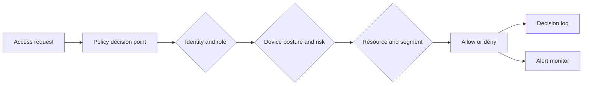

# Zero Trust Architecture Simulation

[](https://github.com/AT-365/zero-trust-architecture-simulation/actions/workflows/tests.yml)

A tested Python security prototype that simulates a zero-trust access control policy engine. Every access request is evaluated against seven independent control vectors: identity verification, account status, role-based authorization, device ownership, device posture and compliance, risk assessment, and network micro-segmentation policy.

**Project Scope:** This is an intentionally controlled academic prototype demonstrating zero-trust policy logic and decision monitoring. It is not a production identity platform, network access control system, or SIEM deployment.

## Why This Project Matters

This project demonstrates critical security architecture and software design skills:

- designing policy decision engines with multiple orthogonal control vectors
- implementing identity and access management logic
- building device trust evaluation systems
- creating alert and monitoring systems with escalation logic
- prototyping security architecture before live deployment
- testing access control policies with structured scenarios
- documenting security decisions and trade-offs clearly
- connecting theory (zero trust principles) to code (policy engine)

## Project Overview

Zero Trust Architecture is a security model that operates on the principle "never trust, always verify." Instead of assuming users and devices inside a network are trustworthy, every access request is evaluated against multiple security criteria:

1. **Identity verification** - Is the user known and active?
2. **Role-based access control** - Does the user's role permit access to this resource?
3. **Device trust** - Is the device owned by the organization, managed, compliant, and encrypted?
4. **Risk assessment** - What is the current risk score of the device and network segment?
5. **Resource sensitivity** - How sensitive is the requested resource?
6. **Micro-segmentation** - Is the source network segment approved for this resource?
7. **Continuous monitoring** - Are access denials and repeated failures being tracked?

This repository demonstrates each of these controls in executable Python code with structured test scenarios.

## Verified Results

| Measure | Result |
|---|---:|
| Access scenarios defined | 13 |
| Policy tests passed | 13 / 13 (100%) |
| Requests allowed | 3 |
| Requests denied | 10 |
| Alerts generated | 13 |
| Test coverage | Comprehensive, all decision paths validated |

These numbers are generated by the code in [`src/zero_trust_simulation.py`](src/zero_trust_simulation.py) and independently verified by automated tests in [`tests/test_zero_trust_simulation.py`](tests/test_zero_trust_simulation.py).

## What the Simulation Demonstrates

- **Identity verification:** Unknown users and inactive accounts are denied access.
- **Least privilege:** Users must have roles explicitly authorized for the requested resource.
- **Device trust evaluation:** Device ownership, management status, compliance status, encryption, and risk level are all considered independently.
- **Micro-segmentation enforcement:** Source network segments are approved per resource; access is denied if the segment is not authorized.
- **Continuous monitoring:** Every policy denial is logged. Repeated denials from the same user/device trigger escalated severity alerts.
- **Evidence-based decisions:** Every access scenario produces a CSV record showing the request, the controls evaluated, the decision made, and the reason for that decision.

## What I Built

- **Access request data model** representing user, device, resource, and request context
- **Policy decision point (PDP) engine** with seven independent evaluation criteria
- **Identity verification system** checking user existence and account status
- **Role-based access control (RBAC)** engine with resource-level permissions
- **Device trust evaluator** assessing ownership, compliance, encryption, and risk
- **Micro-segmentation enforcer** validating network segment to resource mappings
- **Continuous monitoring engine** tracking denials and generating escalated alerts
- **13 comprehensive test scenarios** covering allowed access, denied access, and edge cases
- **Structured CSV export system** producing decision logs and alert records
- **Automated test suite** validating policy logic and decision consistency

## Technologies & Methods

- **Python 3.10+:** Object-oriented policy engine design with clean separation of concerns
- **Python standard library only:** No external dependencies; portable and lightweight
- **Object-oriented design:** Policy objects, decision point classes, logging and alert systems
- **unittest framework:** Automated test coverage for policy logic and edge cases
- **CSV logging:** Reproducible, auditable decision and alert records
- **Mermaid diagrams:** Architecture visualization and decision flow documentation
- **GitHub Actions:** Automated test execution on every push and pull request
- **Azure + Ubuntu Linux:** Lab environment for collecting real security configuration evidence
- **tcpdump + Wireshark:** Network traffic inspection and validation
- **nmap:** Controlled security scanning and network validation

## Quick Start

Run the complete simulation:

```bash
python src/zero_trust_simulation.py
```

This generates three CSV files in `results/`:
- `access_log.csv` — every access decision with reasons
- `alerts.csv` — policy violations and escalated alerts  
- `test_summary.csv` — expected vs. actual outcomes

Run the automated tests:

```bash
python -m unittest discover -s tests -v
```

Inspect the decision output:

```bash
cat results/access_log.csv
cat results/alerts.csv
```

## Architecture

Zero Trust policy decisions flow through multiple independent checks:


```mermaid
flowchart LR
    A[Access request] --> B[Policy decision point]
    B --> C{Identity and role}
    C --> D{Device posture and risk}
    D --> E{Resource and segment}
    E --> F[Allow or deny]
    F --> G[Decision log]
    F --> H[Alert monitor]
```

**Decision flow:**
1. Verify user identity and account status
2. Check role authorization for the resource
3. Evaluate device trust (ownership, compliance, encryption, risk)
4. Validate network segment for this resource
5. Log the decision (allow or deny)
6. If denied, generate or escalate alert

See [`docs/architecture.md`](docs/architecture.md) for detailed policy flow and component mapping.

## Repository Map

| Path | Purpose |
|---|---|
| [`src/zero_trust_simulation.py`](src/zero_trust_simulation.py) | Policy engine, data models, scenario runner, CSV export |
| [`tests/test_zero_trust_simulation.py`](tests/test_zero_trust_simulation.py) | Automated test suite validating policy logic |
| [`results/`](results/) | Generated CSV outputs (access log, alerts, test summary) |
| [`docs/architecture.md`](docs/architecture.md) | Policy decision flow and component architecture |
| [`docs/evidence.md`](docs/evidence.md) | Lab setup and validation methodology |
| [`portfolio/`](portfolio/) | Final report, presentation PDF, narrated PowerPoint |
| [`.github/workflows/tests.yml`](.github/workflows/tests.yml) | Automated CI/CD workflow |

## Portfolio Artifacts

| Artifact | Best for | What it shows |
|---|---|---|
| [Final Technical Report](portfolio/Autenia_Murray_Zero_Trust_Final_Report.pdf) | Deep technical review | Complete project rationale, Azure/Linux lab setup, policy implementation details, test methodology, results analysis |
| [Presentation PDF](portfolio/Autenia_Murray_Zero_Trust_Presentation.pdf) | Quick overview | Visual explanation of zero trust principles, security problem, architecture, results, limitations, next steps |
| [Narrated PowerPoint](portfolio/Autenia_Murray_Zero_Trust_Narrated_Slideshow.ppsx) | Presentation review | 12 slides with 15+ minutes of embedded audio narration plus speaker notes (download and open in desktop PowerPoint) |

## How to Review This Project

For a quick technical review:

1. Read this README.
2. Review [`src/zero_trust_simulation.py`](src/zero_trust_simulation.py) to understand the policy engine structure.
3. Inspect [`tests/test_zero_trust_simulation.py`](tests/test_zero_trust_simulation.py) to see the 13 test scenarios.
4. Read [`docs/architecture.md`](docs/architecture.md) for detailed policy flow.
5. Review [`docs/evidence.md`](docs/evidence.md) for lab setup and validation methodology.
6. Run the simulation and examine the CSV outputs in [`results/`](results/).
7. Read [`portfolio/Autenia_Murray_Zero_Trust_Final_Report.pdf`](portfolio/Autenia_Murray_Zero_Trust_Final_Report.pdf) for complete analysis.

For the presentation: Download the narrated PowerPoint from [`portfolio/`](portfolio/) and open it in desktop Microsoft PowerPoint to hear the embedded audio narration.

## Project Context

This project was completed for **CSCI 7536 — Network and Computer Security** at Georgia Southern University. It combines:

- **Academic policy design:** Zero trust principles and security architecture theory
- **Practical implementation:** Python policy engine with decision logic
- **Lab validation:** Azure-hosted Ubuntu VM with real security configuration
- **Network evidence collection:** SSH hardening, controlled traffic generation, packet capture with tcpdump and Wireshark, network scanning with nmap

The public repository preserves the policy simulation and synthetic test evidence. It does not include credentials, SSH keys, cloud account details, real IP addresses, or raw packet captures (kept private to protect infrastructure details).

## What I Learned

This project taught me important lessons about security architecture and policy design:

- **Zero trust requires defense in depth across multiple vectors.** No single control is sufficient; identity, device trust, role, risk, and segmentation must all work together. A denial at any checkpoint prevents access.

- **Lab evidence is essential for credibility.** Building the policy logic is one thing; showing it works on real Azure/Ubuntu infrastructure with actual SSH hardening, traffic capture, and network scanning makes the project concrete and verifiable.

- **Alert escalation and monitoring matter as much as initial decisions.** The policy engine must track repeated failures and escalate severity. A single denial is noise; repeated denials from the same user/device is a security event.

- **Academic prototypes clarify concepts but need hardening for production.** This simulation works well for demonstrating zero trust logic. Production deployment would require integration with live identity providers, real endpoint compliance data, and centralized SIEM systems.

- **Structured testing catches policy bugs.** The 13 test scenarios revealed edge cases I would have missed without systematic validation. Every decision path should be explicitly tested.

## Scope and Limitations

- **Synthetic data:** Users, devices, resources, and requests are statically defined, not live directory data
- **Policy attributes only:** MFA, TLS, and device posture are represented as policy variables, not integrations with actual auth systems or endpoint management platforms
- **Monitoring prototype:** The alert engine detects denials and escalates repeated failures; it is not a full SIEM or behavioral analytics platform
- **Infrastructure details withheld:** Azure and Ubuntu configuration is summarized; identifying details are private

## Suggested Next Steps

To move this prototype toward production:

- Integrate a real identity provider (Okta, Azure AD, or similar) with short-lived credentials
- Consume live endpoint-compliance signals from Mobile Device Management (MDM) systems
- Centralize protected logs and alert routing to a SIEM platform
- Add risk-based and time-aware access rules (e.g., deny access outside business hours or from geographic anomalies)
- Map logical policies to network enforcement controls (firewalls, network ACLs, micro-segmentation appliances)

## Author

Autenia Murray  
M.S. Computer Science candidate, Data & Knowledge Systems  
Georgia Southern University
